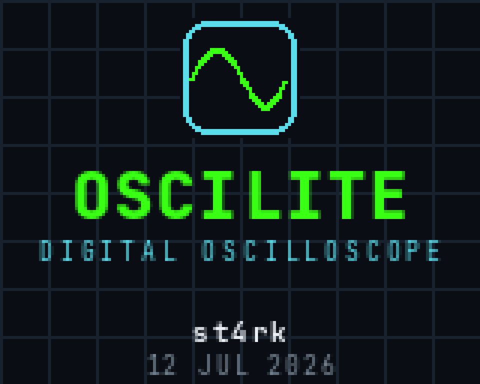
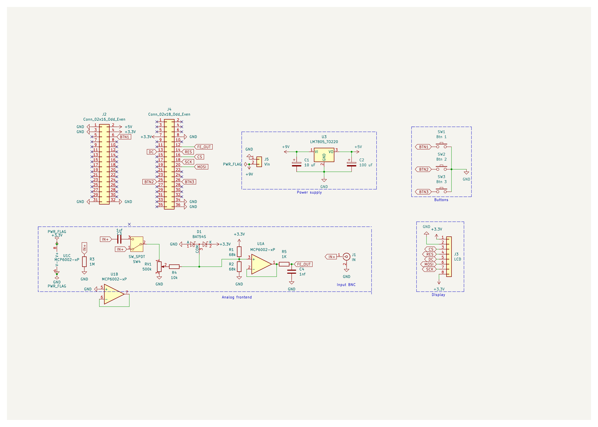
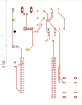
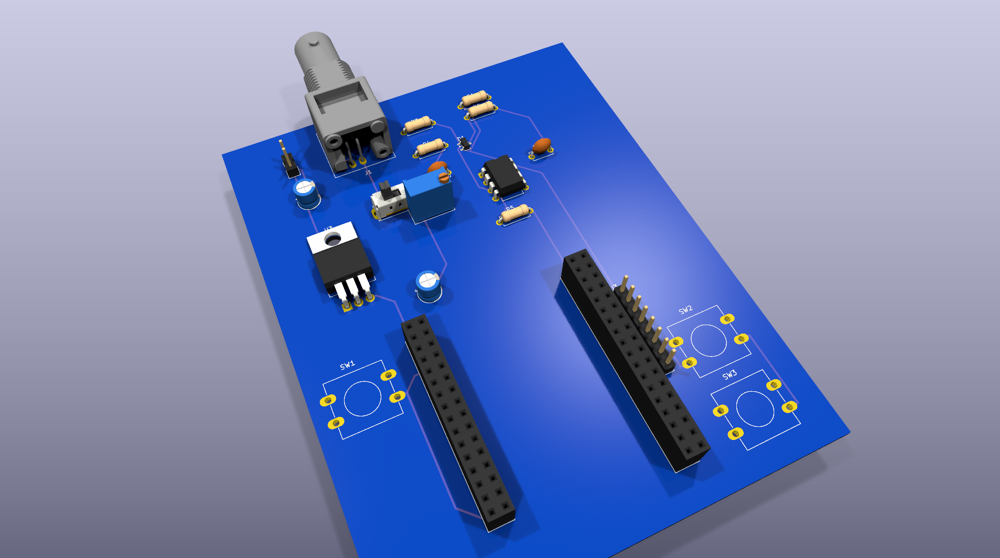
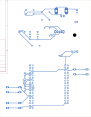
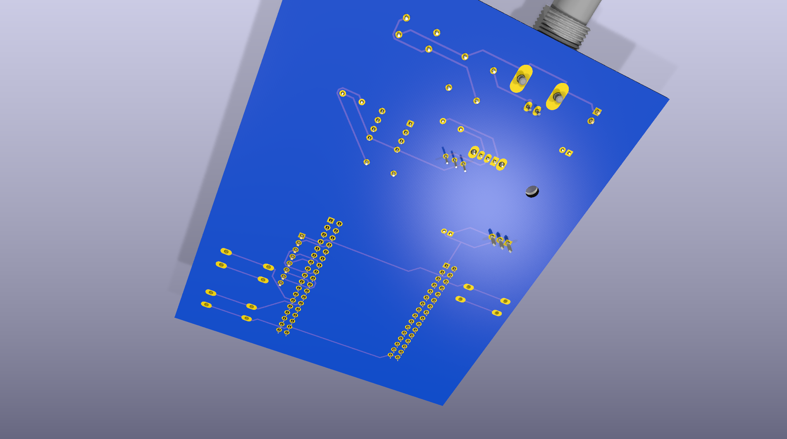

# Oscilite

A digital storage oscilloscope built from scratch on an STM32F407. This project covers the full stack of building a real instrument: analog signal conditioning → ADC sampling → DMA → triggering → rendering → custom PCB hardware design.

Currently running as a breadboard prototype with the V2 custom PCB shield designed and ready for fabrication.

<div align="center">
  
  <p><i>The boot splash rendered on the 160×128 ST7735 TFT at power-on.</i></p>
</div>


*The breadboard prototype running live firmware, capturing and displaying a waveform.*

## Features

- **Live waveform display** on an ILI9341 TFT with an 8×6 division graticule.
- **Hardware‑timed sampling** — a timer (TIM3) drives the ADC so every sample lands at a precise interval (timebase).
- **DMA capture** — the ADC streams samples into memory via DMA with zero CPU involvement (circular buffer on DMA2 Stream0).
- **Software triggering** — rising/falling slope with an adjustable trigger level, so the waveform locks in place instead of jittering.
- **Analog frontend** — attenuates and biases the input to safely measure bipolar signals (centered at ~1.65 V) into the MCU's 0–3.3 V ADC.
- **Automatic measurements** — min / max voltage, peak‑to‑peak, and signal frequency, shown on screen.
- **Boot splash screen** generated from an image via a custom Python pipeline.

## The Breadboard Prototype (V1)

The current working prototype proves out the entire software stack and analog theory.


*Full system context showing the STM32F407 Discovery board, the analog frontend, and the display.*

**How It Works:**
```
 Input ─▶ Analog Frontend ─▶ ADC (12‑bit) ─▶ DMA ─▶ Sample Buffer ─▶ Trigger ─▶ Display
        (attenuate + bias)   (TIM3‑timed)   (circular)              (align)    (ILI9341)
```

The input signal is attenuated and centered at ~1.65 V using an MCP6002 op-amp buffer circuit so it fits the ADC's 0–3.3 V window. A timer fires the ADC at a fixed rate to set the timebase; the DMA engine moves each sample into a circular buffer without the CPU. The firmware then finds the trigger point (rising or falling through the trigger level) and draws the aligned waveform, computing min/max/Vpp and frequency along the way.

*(A deeper write‑up of the theory is in [`docs/HowItWorks.md`](docs/HowItWorks.md))*

## Hardware Design (V2 PCB)

To move past the breadboard stage, a custom 2-layer PCB shield was designed in KiCad 10. The shield mounts directly onto the STM32F407 dev board headers, carrying the analog frontend, BNC connector, user buttons, and a header for the TFT display.

<div align="center">
  
  <p><i>The analog frontend, power distribution, and UI circuitry.</i></p>
</div>

### PCB Layout and Renders
The board is fully routed, DRC-clean, and the Gerbers are ready for manufacturing.

| Top Copper & Silkscreen | 3D Render (Top) |
|:---:|:---:|
|  |  |

| Bottom Copper | 3D Render (Bottom) |
|:---:|:---:|
|  |  |

*Note: The board relies on a dual-header layout designed specifically for the Diymore STM32F407VGT6 development board.*

## Project Structure

```
Core/Src/        Firmware: scope.c, ui.c, wave.c, adc.c, dma.c, tim.c, sandbox.c, main.c
Core/Inc/        Headers (scope.h defines grid, buffer length, trigger constants)
Drivers/         STM32 HAL + CMSIS + Display driver
pcb/fullScope/   KiCad project, layout, DRC reports, Gerbers
docs/            HowItWorks.md, PCB walkthrough
scripts/         Helper scripts (splash image conversion, UI patching)
Scopef407.ioc    STM32CubeMX configuration
```

## Building & Flashing

Prerequisites:
- [STM32CubeMX](https://www.st.com/en/development-tools/stm32cubemx.html) (config is in `Scopef407.ioc`)
- ARM GNU toolchain (`arm-none-eabi-gcc`)
- CMake ≥ 3.22 and Ninja
- A flashing tool: STM32CubeProgrammer, OpenOCD, or st-link

Build:
```bash
# Configure (uses the provided CMake presets)
cmake --preset Debug

# Build
cmake --build build/Debug
```

Flash it with your tool of choice, e.g.:
```bash
st-flash write build/Debug/Scopef407.bin 0x8000000
```

## Project Status & Phases

- **Phase 1 (Complete):** Breadboard prototype, firmware architecture (ADC/DMA/Trigger), and UI rendering.
- **Phase 2 (Current):** Custom PCB shield designed, DRC-verified, and Gerbers generated.
- **Phase 3 (Next):** PCB fabrication, assembly, and testing of the final standalone hardware unit.

This is intentionally a hands-on learning project to understand the full stack of instrument creation, not a precision lab tool.

## Acknowledgments
Built on the STM32 HAL and CMSIS.
